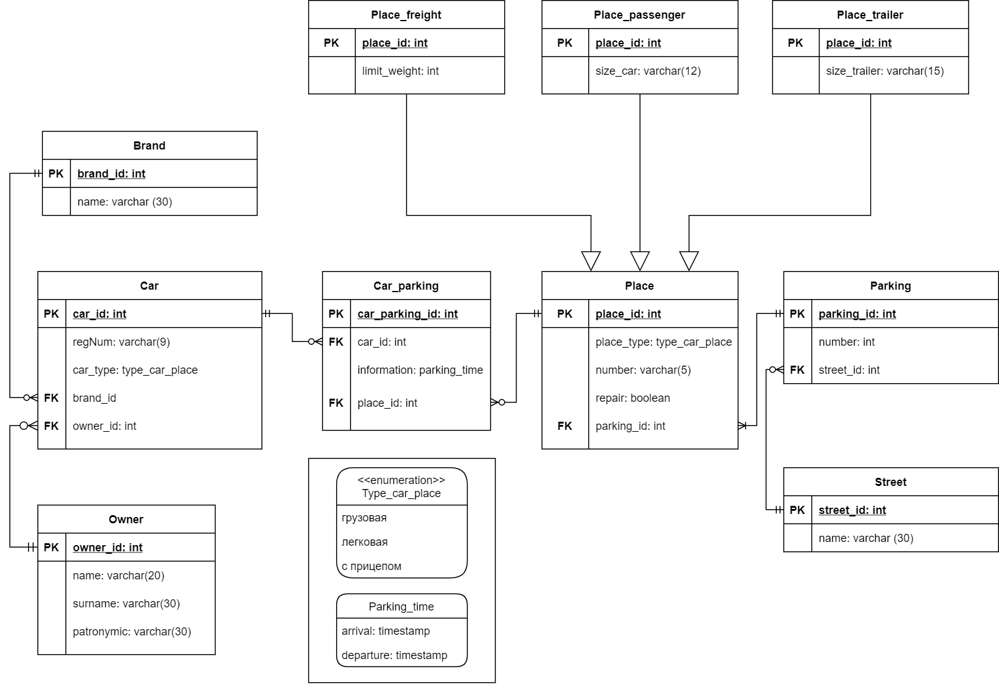

# Объектно-реляционная база данных
## Цель работы
Моделирование структуры объектно-реляционной базы данных (далее БД), использование операторов языка SQL для работы с
данными БД, применение триггеров, пользовательски операторов, пользовательских агрегатных функций.

## Задание
1. Спроектировать физическую модель базы данных, находящуюся в третьей нормальной форме.

2. Создать базу данных по разработанной физической модели.

3. Реализовать триггеры для всех событий (insert, delete, update).

4. Выполнить вставку тестовых данных в таблицы.

5. Реализовать запросы:
   - выборка с условием к предку и потомку;
   - выборка с условием только к предку;
   - выборка с условием только к потомку.
     
6. Создать пользовательский оператор и пользовательскую агрегатную функцию.
   
---
## Выполнение работы
Мной была спроектирована физическая модель следующей предметной области:

**Охраняемые парковки**: адрес парковки, машина, тип машины (грузовая, легковая, с прицепом), места (под разные типы машин, под ремонт), владелец, место, рег. номер машины, дата и время заезда, дата и время выезда 

**Физическая модель:**

Создание и заполнение базы данных представлено в файлах [create_tables.sql](create_tables.sql) и [insert_data.sql](insert_data.sql).

Файл [triggers.sql](triggers.sql) содержит триггеры.

Запросы реализованы в файле [queries.sql](queries.sql).

Пользовательский оператор и пользовательская агрегатная функция выполнены в файле [us_def_operator_us_def_aggr_fun.sql](us_def_operator_us_def_aggr_fun.sql).

---
